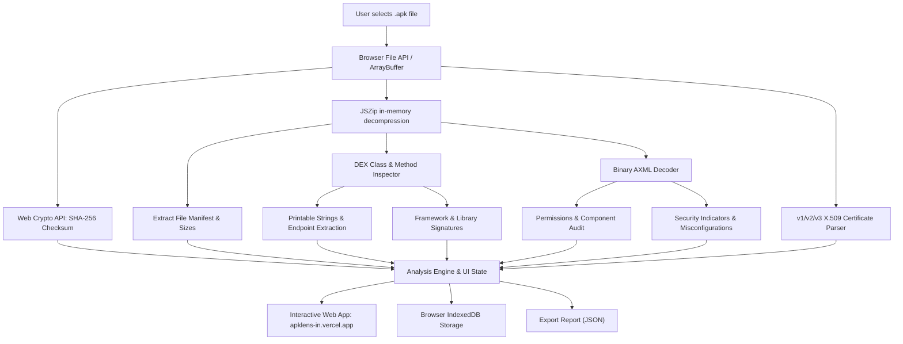

> [!NOTE]
> **APKLens is live at [apklens-in.vercel.app](https://apklens-in.vercel.app/):** Privacy-first, 100% client-side Android APK inspection, native binary AXML decoding, X.509 certificate parsing, and JADX source decompilation directly in your browser.

# 🔍 APKLens

### Autonomous, Privacy-First Browser-Based Android APK Inspector & Static Analyzer

**Zero server uploads. 100% Client-Side. Instant Security Insights.**

<strong>Developed with ❤️ by <a href="https://github.com/jojin1709">JOJIN JOHN</a></strong>

### 🌐 Access APKLens Directly Online:
## 👉 **[https://apklens-in.vercel.app/](https://apklens-in.vercel.app/)** 👈

No installation or setup required. Drop an .apk file into your browser to begin auditing immediately.

---

---

> [!TIP]
> **Zero Network Transfer:** APKLens operates completely offline in your browser sandbox using `FileReader`, `JSZip`, and Web Crypto APIs. Sensitive enterprise APKs never leave your local machine.

---

## 📑 Table of Contents

- [What is APKLens?](#-what-is-apklens)
  - [Why APKLens Exists](#why-apklens-exists)
  - [The Privacy-First Advantage](#the-privacy-first-advantage)
  - [Designed for Security Researchers & Developers](#designed-for-security-researchers--developers)
- [Key Capabilities](#-key-capabilities)
- [Architecture & How It Works](#-architecture--how-it-works)
- [How to Use APKLens](#-how-to-use-apklens)
- [Author & Credits](#-author--credits)
- [License & Intellectual Property](#-license--intellectual-property)

---

## 🔎 What is APKLens?

**APKLens** is an interactive, browser-based static security inspector for Android packages (`.apk`). Built using **Next.js 15**, **React 19**, and modern web standards, it turns the browser into a high-performance APK decompression and triage suite.

APKLens unpacks archives locally, calculates cryptographically secure hashes, sweeps DEX bytecode for strings and endpoints, maps library signatures, audits manifest permissions, decodes binary AXML, parses signing certificates, and flags known security anti-patterns—all without sending a single byte across the internet.

<strong>Why APKLens Exists</strong>

Security analysts, reverse engineers, and QA developers frequently need quick reconnaissance on Android APKs. However, existing public web analyzers require uploading potentially proprietary, NDA-protected, or unreleased binaries to third-party cloud servers. 

APKLens bridges this gap by leveraging client-side WebAssembly, Web Crypto, and streaming archive parsing to execute static triage locally in seconds.

<strong>The Privacy-First Advantage</strong>

- **No Remote File Storage:** Your `.apk` is processed directly in browser memory.
- **Offline Capable:** Once loaded, APKLens can run without an active internet connection.
- **Local Persistence:** Scan records are saved in your browser's local **IndexedDB**, ensuring your triage history stays exclusively under your control.

<strong>Designed for Security Researchers & Developers</strong>

Whether you're performing bug bounty recon, checking third-party SDK dependencies, verifying manifest export misconfigurations, or inspecting compiled DEX classes, APKLens delivers clean, instant results.

---

## ⚡ Key Capabilities

- 🛡️ **Client-Side SHA-256 Hashing:** Computes cryptographic file fingerprints instantly using the browser's native Web Crypto API.
- 📜 **Native Binary AXML Decoder:** Decodes binary compiled `AndroidManifest.xml` files in real-time, extracting real package metadata, activities, services, broadcast receivers, content providers, and permissions.
- 🔑 **APK Signature & Certificate Analyzer:** Extracts X.509 certificates from APK v1 (JAR signing) and v2/v3 (APK Signing Block) structures, parsing Subject, Issuer, Validity Dates, and SHA-1/SHA-256 fingerprints.
- 📦 **In-Memory Archive Decompression:** Reads ZIP directory headers and entry tables locally using `JSZip` without hitting filesystem I/O.
- ☕ **DEX Class & Method Inspector:** Parses Dalvik bytecode headers to extract compiled Java/Kotlin class descriptors, method counts, and printable strings.
- 🌐 **Live JADX Decompiler Integration:** Seamlessly connects with the high-performance JADX engine to decompile Dalvik classes into readable Java/Kotlin source code on-demand.
- 🔍 **Framework & SDK Fingerprinting:** Automatically identifies incorporated libraries and SDKs (e.g., React Native, Flutter, Unity, Firebase, OkHttp, Retrofit).
- 💾 **IndexedDB Session Vault:** Automatically persists your analysis history locally so you can revisit past scans across sessions.
- 📤 **JSON Report Export:** Generates standardized, machine-readable JSON dumps of all extracted artifacts, hashes, and indicators for automated reporting.

---

## 🏗️ Architecture & How It Works

---

## 🚀 How to Use APKLens

APKLens is officially hosted and ready for instant use:

1. Visit **[https://apklens-in.vercel.app/](https://apklens-in.vercel.app/)** in any modern web browser.
2. Drag and drop any `.apk` file into the analyzer window.
3. Explore the results across tabs:
   - **Overview:** General metrics, cryptographic hash, and evidence-based security findings.
   - **File Explorer:** Interactive tree of every file inside the APK.
   - **AndroidManifest:** Decoded XML manifest view.
   - **Permissions:** Full list of requested Android permissions.
   - **Components:** Exported activities, services, receivers, and content providers.
   - **DEX / Code:** Compiled Java/Kotlin classes and on-demand source code decompilation.
   - **Certificate & Signing:** Detailed X.509 certificate data and fingerprints.
   - **Reports:** One-click JSON analysis export.

---

## 👨‍💻 Author & Credits

### Designed & Developed by **JOJIN JOHN**
*Software Engineer | Security Researcher | Full Stack Developer*

---

## 📄 License & Intellectual Property

Copyright (c) 2026 **JOJIN JOHN**. All rights reserved.

The official web application is accessible for public security analysis, bug bounty triage, and research at **[https://apklens-in.vercel.app/](https://apklens-in.vercel.app/)**. Unauthorized reproduction, redistribution, or duplication of this application is strictly prohibited.