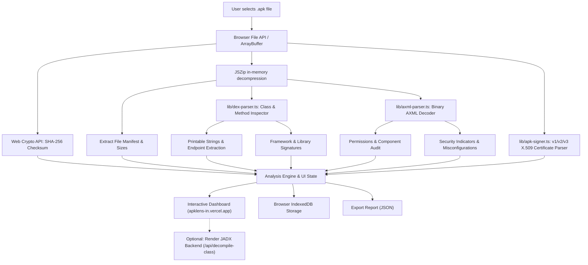

> [!NOTE]
> **APKLens v2.0 is live at [apklens-in.vercel.app](https://apklens-in.vercel.app/):** Privacy-first, 100% client-side Android APK inspection, native binary AXML decoding, X.509 certificate parsing, and JADX source decompilation right inside your browser.

<div align="center">

# 🔍 APKLens

### Autonomous, Privacy-First Browser-Based Android APK Inspector & Static Analyzer

**Zero server uploads. 100% Client-Side. Instant Security Insights.**

[](https://apklens-in.vercel.app/)
[](https://nextjs.org/)
[](https://react.dev/)
[](https://www.typescriptlang.org/)
[](LICENSE)

<p><strong>Developed with ❤️ by <a href="https://github.com/jojin1709">JOJIN JOHN</a></strong></p>

```bash
# Clone and launch APKLens locally
git clone https://github.com/jojin1709/APKlens-.git
cd APKlens-
npm install
npm run dev
```

<sub>Open <a href="http://localhost:3000">http://localhost:3000</a> to begin auditing Android APKs.</sub>

---

<a href="https://github.com/jojin1709/APKlens-"></a>
&nbsp;&nbsp;&nbsp;&nbsp;
<a href="https://apklens-in.vercel.app/"></a>

---

</div>

> [!TIP]
> **Zero Network Transfer:** APKLens operates completely offline in your browser sandbox using `FileReader`, `JSZip`, and Web Crypto APIs. Sensitive enterprise APKs never leave your local machine unless you explicitly connect your isolated JADX decompiler backend.

---

## 📑 Table of Contents

- [Table of Contents](#-table-of-contents)
- [What is APKLens?](#-what-is-apklens)
  - [Why APKLens Exists](#why-apklens-exists)
  - [The Privacy-First Advantage](#the-privacy-first-advantage)
  - [Designed for Security Researchers & Developers](#designed-for-security-researchers--developers)
- [Key Capabilities](#-key-capabilities)
- [Architecture & How It Works](#-architecture--how-it-works)
- [Quick Start](#-quick-start)
  - [Prerequisites](#prerequisites)
  - [Installation & Local Run](#installation--local-run)
  - [Building for Production](#building-for-production)
- [Deploy to Vercel (Frontend)](#-deploy-to-vercel-frontend)
- [Deploy to Render (Free JADX Backend)](#-deploy-to-render-free-jadx-backend)
- [Author & Credits](#-author--credits)
- [License](#-license)

---

## 🔎 What is APKLens?

**APKLens** is an interactive, browser-based static security inspector for Android packages (`.apk`). Built using **Next.js 15**, **React 19**, and modern web standards, it turns the browser into a high-performance APK decompression and triage suite.

APKLens unpacks archives locally, calculates cryptographically secure hashes, sweeps DEX bytecode for strings and endpoints, maps library signatures, audits manifest permissions, decodes binary AXML, parses signing certificates, and flags known security anti-patterns—all without sending a single byte across the internet.

<details>
<summary><strong>Why APKLens Exists</strong></summary>

Security analysts, reverse engineers, and QA developers frequently need quick reconnaissance on Android APKs. However, existing public web analyzers require uploading potentially proprietary, NDA-protected, or unreleased binaries to third-party cloud servers. 

APKLens bridges this gap by leveraging client-side WebAssembly, Web Crypto, and streaming archive parsing to execute static triage locally in seconds.

</details>

<details>
<summary><strong>The Privacy-First Advantage</strong></summary>

- **No Remote File Storage:** Your `.apk` is processed directly in browser memory.
- **Offline Capable:** Once loaded, APKLens can run without an active internet connection.
- **Local Persistence:** Scan records are saved in your browser's local **IndexedDB**, ensuring your triage history stays exclusively under your control.

</details>

<details>
<summary><strong>Designed for Security Researchers & Developers</strong></summary>

Whether you're performing bug bounty recon, checking third-party SDK dependencies, verifying manifest export misconfigurations, or inspecting compiled DEX classes, APKLens delivers clean, instant results.

</details>

---

## ⚡ Key Capabilities

- 🛡️ **Client-Side SHA-256 Hashing:** Computes cryptographic file fingerprints instantly using the browser's native Web Crypto API.
- 📜 **Native Binary AXML Decoder:** Decodes binary compiled `AndroidManifest.xml` files in real-time, extracting real package metadata, activities, services, broadcast receivers, content providers, and permissions.
- 🔑 **APK Signature & Certificate Analyzer:** Extracts X.509 certificates from APK v1 (JAR signing) and v2/v3 (APK Signing Block) structures, parsing Subject, Issuer, Validity Dates, and SHA-1/SHA-256 fingerprints.
- 📦 **In-Memory Archive Decompression:** Reads ZIP directory headers and entry tables locally using `JSZip` without hitting filesystem I/O.
- ☕ **DEX Class & Method Inspector:** Parses Dalvik bytecode headers to extract compiled Java/Kotlin class descriptors, method counts, and printable strings.
- 🌐 **JADX Source Decompiler Connector:** Connect your own containerized JADX backend (running on Render or locally) to decompile Dalvik classes into readable Java source code on-demand.
- 🔍 **Framework & SDK Fingerprinting:** Automatically identifies incorporated libraries and SDKs (e.g., React Native, Flutter, Unity, Firebase, OkHttp, Retrofit).
- 💾 **IndexedDB Session Vault:** Automatically persists your analysis history locally so you can revisit past scans across sessions.
- 📤 **JSON Report Export:** Generates standardized, machine-readable JSON dumps of all extracted artifacts, hashes, and indicators for automated reporting.

---

## 🏗️ Architecture & How It Works



---

## 🚀 Quick Start

### Prerequisites

- **Node.js**: `18.x`, `20.x`, or higher
- **Package Manager**: `npm`, `pnpm`, or `yarn`

### Installation & Local Run

```bash
# 1. Clone repository
git clone https://github.com/jojin1709/APKlens-.git

# 2. Enter workspace
cd APKlens-

# 3. Install dependencies
npm install

# 4. Start local development server
npm run dev
```

Visit [http://localhost:3000](http://localhost:3000) in your web browser.

### Building for Production

```bash
npm run build
npm run start
```

---

## 🌐 Deploy to Vercel (Frontend)

APKLens is natively built on Next.js and requires **zero server configuration or environment secrets** to deploy.

1. Go to [Vercel Dashboard](https://vercel.com/new).
2. Click **"Import Project"** and select **`jojin1709/APKlens-`**.
3. Keep default settings (**Framework:** Next.js, **Build Command:** `next build`, **Output:** `.next`).
4. Click **Deploy**. Your app is live globally on Vercel's Edge Network!

---

## ⚡ Deploy to Render (Free JADX Backend)

To enable live **Java / Kotlin source code decompilation** from the DEX tab:

1. Go to [Render Dashboard](https://dashboard.render.com/).
2. Click **"New +"** -> **"Web Service"**.
3. Select your repository: `jojin1709/APKlens-`.
4. Fill in the fields:
   - **Language / Runtime:** `Docker`
   - **Root Directory:** `backend`
   - **Instance Type:** **Free ($0 / month)**
   - **Health Check Path:** `/health`
5. Click **"Deploy Web Service"**.
6. Copy your Render URL (e.g. `https://apklens-backend.onrender.com`).
7. In **APKLens**, click **"Connect JADX Backend"** in the **DEX / Code** tab and paste your URL!

---

## 👨‍💻 Author & Credits

<div align="center">

### Developed with ❤️ by **JOJIN JOHN**
*Software Engineer | Security Researcher | Full Stack Developer*

[](https://github.com/jojin1709)
[](https://apklens-in.vercel.app/)

</div>

---

## 📄 License

This project is licensed under the [MIT License](LICENSE).
Feel free to use, modify, and distribute it for personal, academic, or commercial security research.