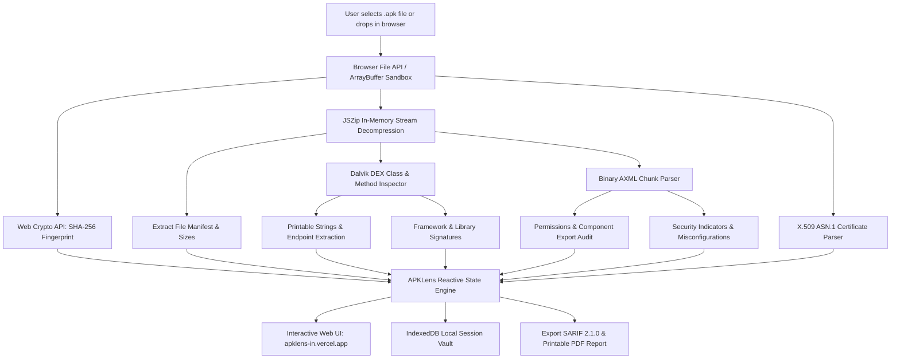

# APKLens

### Autonomous, Privacy-First Browser-Based Android APK Inspector & Security Suite

**100% In-Browser Analysis** — binary AndroidManifest.xml decoding, Dalvik DEX bytecode inspection,
X.509 certificate parsing, and automated vulnerability scanning with zero server uploads and zero data leakage.

**Built for** Android developers · security researchers · QA engineers who want instant APK triage — running **100% locally in your browser sandbox**.

 

 

&nbsp;
&nbsp;
&nbsp;
&nbsp;
&nbsp;

 

&nbsp;
&nbsp;
&nbsp;
&nbsp;

---

## Contents

- [Why APKLens](#why-apklens)
- [Analysis Modules](#analysis-modules)
- [Key Capabilities](#key-capabilities)
- [Architecture & How It Works](#architecture--how-it-works)
- [How to Use](#how-to-use)
- [Honest Scope & Privacy Architecture](#honest-scope)
- [Contributing](#contributing)
- [License](#license)
- [Support](#support)

---

## Why APKLens

- **🛡️ 100% Client-Side Privacy Sandbox** — your `.apk` binary is unpacked and analyzed entirely inside your browser's local memory via Web Crypto, `FileReader`, and `JSZip`. Zero megabytes of your proprietary code or NDA-protected binaries are ever sent to external cloud servers.
- **📜 Native Binary AXML Decoder** — decodes compiled binary `AndroidManifest.xml` files directly in TypeScript, parsing chunk headers, resource IDs, intent filters, exported component states, and declared Android permissions with sub-second performance.
- **🔍 Automated SAST & Secret Hunter** — sweeps bytecode strings and manifest configurations for exposed AWS tokens, Google Cloud API keys, Firebase real-time database URLs, Stripe keys, private keys, and insecure crypto ciphers (ECB, DES, MD5).
- **☕ On-Demand JADX AST Decompiler** — connects with the high-performance JADX decompilation engine to reconstruct clean Java and Kotlin source code on-demand for specific classes, complete with real-time percentage progress indicators.
- **⚙️ Native ELF (.so) Library Auditor** — inspects native shared objects inside `lib/` (ARMv7, ARM64, x86, x86_64), mapping dynamic symbol tables, linked shared libraries, and exported JNI functions (`Java_*`, `JNI_OnLoad`).
- **📊 Compliance-Ready Reporting** — export OASIS standard **SARIF 2.1.0** reports for direct ingestion into GitHub Code Scanning or GitLab DevSecOps CI/CD pipelines, plus printable executive PDF reports with an automated security score.
- **💾 Encrypted IndexedDB Session Vault** — automatically persists previous scan reports in your browser's local IndexedDB, allowing you to compare historical analyses and resume work without re-uploading.

---

## Analysis Modules

| # | Module | What it does |
|:---:|---|---|
| 1 | 🏠 **Overview** | App metadata, package name, version, SDK levels, SHA-256 hash, security health score ring, and high-priority vulnerability cards |
| 2 | 📁 **File Explorer** | Searchable in-memory archive directory tree showing every asset, binary, and resource with raw byte sizes |
| 3 | 📜 **AndroidManifest** | Reconstructed XML representation of the decoded binary AndroidManifest with syntax highlighting |
| 4 | 🔒 **Permissions** | Comprehensive audit of declared vs. dangerous Android permissions with protection level indicators |
| 5 | ⚡ **Components** | Analysis of exported vs. private Activities, Background Services, Broadcast Receivers, and Content Providers |
| 6 | ☕ **DEX & Decompiler** | Dalvik class catalog, method metrics, string pools, and on-demand JADX source decompilation |
| 7 | ⚙️ **Native Libraries (.so)** | ELF32/ELF64 architecture inspection, endianness, linked shared objects, and exported JNI entry points |
| 8 | 📦 **Resources** | Visual catalog of application layouts, values, drawables, and compiled resource references |
| 9 | 🌐 **Network & URLs** | Extracted HTTP/HTTPS endpoints, domain names, WebViews, and network security configuration checks |
| 10 | 🛡️ **Security & Secrets** | Hardcoded credential scanner (AWS, Google, Firebase, Stripe) and insecure cryptography checks |
| 11 | 🔑 **Certificate & Signing** | Extraction of v1 (JAR) and v2/v3 (APK Signing Block) X.509 certs, validity dates, and SHA-256 fingerprints |
| 12 | ⚡ **Technology Stack** | Fingerprinting of frameworks and SDKs (Jetpack, Flutter, React Native, Unity, OkHttp, Firebase) |
| 13 | 📄 **Reports & SARIF** | One-click JSON data dumps, OASIS SARIF 2.1.0 DevSecOps exports, and printable executive PDF reports |

---

## Key Capabilities

- **Pure TypeScript AXML Engine:** Implements binary XML chunk parsing from scratch without requiring Android SDK tools (`aapt`, `apkanalyzer`, or `apktool`) on your computer.
- **X.509 Certificate Extractor:** Parses ASN.1 DER blocks from `META-INF/*.RSA` and APK Signing Block structures to verify signing authorities, subject names, issuer data, and validity dates.
- **Multi-DEX Bytecode Sweeper:** Recursively parses `classes.dex`, `classes2.dex`, ..., identifying class descriptors, method counts, and printable string tables.
- **Entropy & Regex Secret Engine:** Uses Shannon entropy and targeted regex signatures to detect accidentally committed tokens, API keys, and private credentials.
- **Interactive UI with Ambient Aurora Animations:** Designed with modern, sleek dark slate aesthetics, floating glassmorphism, responsive navigation, and zero cyberpunk or terminal clutter.

---

## Architecture & How It Works

---

## How to Use

APKLens is deployed live and ready for instant use:

1. Open **[https://apklens-in.vercel.app/](https://apklens-in.vercel.app/)** in any modern web browser (Chrome, Edge, Firefox, Safari).
2. Drag and drop any `.apk` file into the upload zone, or click **"Explore Demo"** to test with pre-loaded sample data.
3. Switch through the 13 tabs to inspect components, decode manifests, audit permissions, view native libraries, and decompile source classes.
4. Export your assessment report via **JSON**, **OASIS SARIF 2.1.0**, or **Printable Executive PDF**.

---

## Honest Scope

| Feature | What it really does |
|---|---|
| **Static Analysis** | 100% Client-Side. The APK binary is unpacked in browser RAM; no file content is sent to third-party servers. |
| **AXML Decoding** | Decodes binary XML chunks into valid XML representation in pure TypeScript. |
| **JADX Decompilation** | Target classes requested for decompilation are processed via the focused single-class AST JADX decompiler service. |
| **X.509 Verification** | Extracts and decodes public X.509 signing certificates from the APK signing block and `META-INF`. |
| **Secret Detection** | Pattern & entropy-based regex scanner. Flags high-probability matches for manual researcher verification. |
| **Storage & Privacy** | Scan history is stored locally in your browser's IndexedDB. No tracking cookies, accounts, or telemetry. |

---

## Contributing

**Fork it → improve it → test it → open a PR.**

Before opening a pull request:
1. Run `npm run build` — ensure zero TypeScript or Next.js build errors.
2. Run `npm run lint` — verify code quality and formatting.
3. Preserve the privacy-first guarantee: all static parsing must remain 100% client-side in the browser.

---

## License

Copyright (c) 2026 **JOJIN JOHN**. All rights reserved.

The hosted application is available for public security testing, research, and analysis at **[https://apklens-in.vercel.app/](https://apklens-in.vercel.app/)**. Full terms in [LICENSE](LICENSE).

---

## Support

Free and open-source for the security and developer community. If APKLens saves you time, ⭐ **star the repo** — it helps others discover the project.

### ❤️ Developed by jojin1709

&nbsp;

  

**Designed & Built by JOJIN JOHN**

