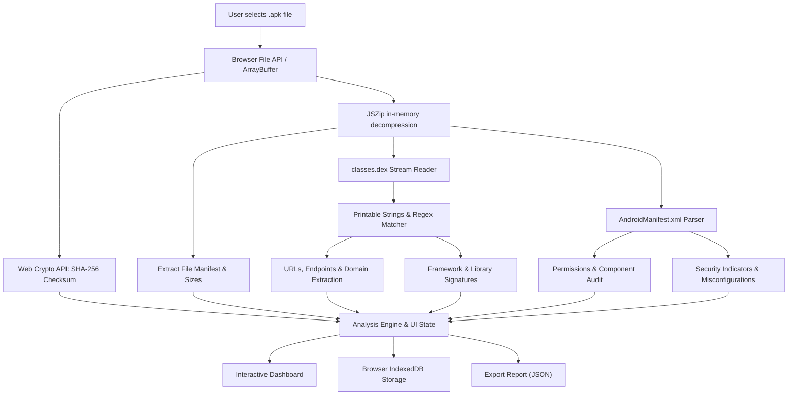

> [!NOTE]
> **APKLens v1.0 is live:** Privacy-first, 100% client-side Android APK inspection and static security analysis right inside your browser. No file uploads. No server-side leaks.

<div align="center">

# 🔍 APKLens

### Autonomous, Privacy-First Browser-Based Android APK Inspector & Static Analyzer

**Zero server uploads. 100% Client-Side. Instant Security Insights.**

[](https://nextjs.org/)
[](https://react.dev/)
[](https://www.typescriptlang.org/)
[](LICENSE)
[](https://vercel.com/new)

<p><strong>Developed with ❤️ by <a href="https://github.com/jojin1709">JOJIN JOHN</a></strong></p>

```bash
# Clone and launch APKLens locally
git clone https://github.com/jojin1709/APKlens-.git
cd APKlens-
npm install
npm run dev
```

<sub>Open <a href="http://localhost:3000">http://localhost:3000</a> to begin auditing Android APKs with zero server upload.</sub>

---

<a href="https://github.com/jojin1709/APKlens-"></a>
&nbsp;&nbsp;&nbsp;&nbsp;
<a href="https://vercel.com/new/clone?repository-url=https%3A%2F%2Fgithub.com%2Fjojin1709%2FAPKlens-"></a>

---

</div>

> [!TIP]
> **Zero Network Transfer:** APKLens operates completely offline in your browser sandbox using `FileReader`, `JSZip`, and Web Crypto APIs. Sensitive enterprise APKs never leave your local machine.

---

## 📑 Table of Contents

- [Table of Contents](#-table-of-contents)
- [What is APKLens?](#-what-is-apklens)
  - [Why APKLens Exists](#why-apklens-exists)
  - [The Privacy-First Advantage](#the-privacy-first-advantage)
  - [Designed for Security Researchers & Developers](#designed-for-security-researchers--developers)
- [Key Capabilities](#-key-capabilities)
- [Architecture & How It Works](#-architecture--how-it-works)
- [Quick Start](#-quick-start)
  - [Prerequisites](#prerequisites)
  - [Installation & Local Run](#installation--local-run)
  - [Building for Production](#building-for-production)
- [Deploy to Vercel](#-deploy-to-vercel)
  - [Method 1: One-Click Vercel Web Dashboard (Recommended)](#method-1-one-click-vercel-web-dashboard-recommended)
  - [Method 2: Vercel CLI](#method-2-vercel-cli)
- [Technical Limitations & Roadmap](#-technical-limitations--roadmap)
- [Privacy & Security Guarantee](#-privacy--security-guarantee)
- [Author & Credits](#-author--credits)
- [License](#-license)

---

## 🔎 What is APKLens?

**APKLens** is an interactive, browser-based static security inspector for Android packages (`.apk`). Built using **Next.js 15**, **React 19**, and modern web standards, it turns the browser into a high-performance APK decompression and triage suite.

APKLens unpacks archives locally, calculates cryptographically secure hashes, sweeps DEX bytecode for strings and endpoints, maps library signatures, audits manifest permissions, and flags known security anti-patterns—all without sending a single byte across the internet.

<details>
<summary><strong>Why APKLens Exists</strong></summary>

Security analysts, reverse engineers, and QA developers frequently need quick reconnaissance on Android APKs. However, existing public web analyzers require uploading potentially proprietary, NDA-protected, or unreleased binaries to third-party cloud servers. 

APKLens bridges this gap by leveraging client-side WebAssembly, Web Crypto, and streaming archive parsing to execute static triage locally in seconds.

</details>

<details>
<summary><strong>The Privacy-First Advantage</strong></summary>

- **No Remote File Storage:** Your `.apk` is processed directly in browser memory.
- **Offline Capable:** Once loaded, APKLens can run without an active internet connection.
- **Local Persistence:** Scan records are saved in your browser's local **IndexedDB**, ensuring your triage history stays exclusively under your control.

</details>

<details>
<summary><strong>Designed for Security Researchers & Developers</strong></summary>

Whether you're performing bug bounty recon, checking third-party SDK dependencies, verifying manifest export misconfigurations, or looking for hardcoded endpoints, APKLens delivers clean, instant results.

</details>

---

## ⚡ Key Capabilities

- 🛡️ **Client-Side SHA-256 Hashing:** Computes cryptographic file fingerprints instantly using the browser's native Web Crypto API.
- 📦 **In-Memory Archive Decompression:** Reads ZIP directory headers and entry tables locally using `JSZip` without hitting filesystem I/O.
- 🔤 **DEX String & Endpoint Recon:** Parses `.dex` byte streams, extracting printable strings, candidate API URLs, C2 domains, and suspicious IP patterns.
- 🔍 **Framework & SDK Fingerprinting:** Automatically identifies incorporated libraries and SDKs (e.g., React Native, Flutter, Unity, Firebase, OkHttp, Retrofit).
- 📜 **Manifest Security Inspection:** Audits permissions, exported components, backup flags, debuggability, and cleartext traffic settings (when manifest is supplied or readable).
- 💾 **IndexedDB Session Vault:** Automatically persists your analysis history locally so you can revisit past scans across sessions.
- 📤 **JSON Report Export:** Generates standardized, machine-readable JSON dumps of all extracted artifacts, hashes, and indicators for automated reporting.

---

## 🏗️ Architecture & How It Works



---

## 🚀 Quick Start

### Prerequisites

- **Node.js**: `18.x` or `20.x` or higher
- **Package Manager**: `npm`, `pnpm`, or `yarn`

### Installation & Local Run

```bash
# 1. Clone repository
git clone https://github.com/jojin1709/APKlens-.git

# 2. Enter workspace
cd APKlens-

# 3. Install dependencies
npm install

# 4. Start local development server
npm run dev
```

Visit [http://localhost:3000](http://localhost:3000) in your web browser.

### Building for Production

```bash
npm run build
npm run start
```

---

## 🌐 Deploy to Vercel

APKLens is natively built on Next.js and requires **zero server configuration or environment secrets** to deploy.

### Method 1: One-Click Vercel Web Dashboard (Recommended)

1. Push your repository to GitHub: `https://github.com/jojin1709/APKlens-.git`
2. Go to [Vercel Dashboard](https://vercel.com/new).
3. Click **"Import Project"** and select **`APKlens-`**.
4. Keep all default build settings:
   - **Framework Preset:** Next.js
   - **Build Command:** `next build`
   - **Output Directory:** `.next`
5. Click **Deploy**. Your app will be live globally on Vercel's Edge Network in under a minute!

### Method 2: Vercel CLI

```bash
# Install Vercel CLI globally (if not installed)
npm install -g vercel

# Authenticate and deploy
vercel
```

---

## ⚠️ Technical Limitations & Roadmap

> [!WARNING]
> **Binary AndroidManifest.xml (AXML):** Production APKs compress `AndroidManifest.xml` into binary AXML. This lightweight browser-only release extracts plain XML and strings without emulating heavy binary decoding.

### Planned Enhancements:
- [ ] Client-side WebAssembly parser for binary AXML decoding.
- [ ] APK v1/v2/v3 signing certificate extractor & validation.
- [ ] Deep native `.so` symbol demangling.
- [ ] Optional isolated container backend connector (JADX, Apktool, YARA, Androguard).

---

## 🔒 Privacy & Security Guarantee

- **Zero telemetry on binaries:** The APK file content is never transmitted across the network.
- **Client-side sandbox:** Analysis takes place exclusively within your browser's V8 Javascript sandbox.
- **Self-contained storage:** Scan records reside solely within the origin's local IndexedDB.

---

## 👨‍💻 Author & Credits

<div align="center">

### Developed by **JOJIN JOHN**
*Software Engineer | Security Researcher | Full Stack Developer*

[](https://github.com/jojin1709)

</div>

---

## 📄 License

This project is licensed under the [MIT License](LICENSE).
Feel free to use, modify, and distribute it for personal, academic, or commercial security research.